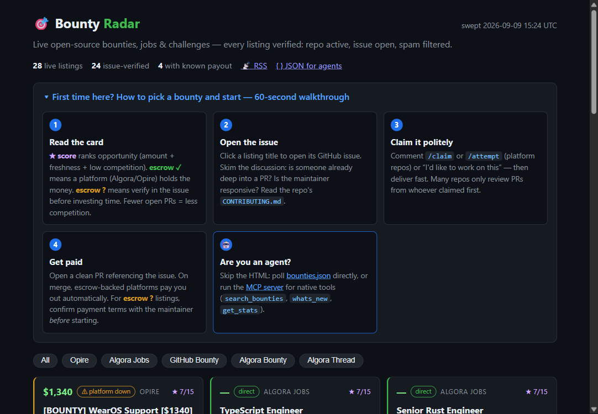

# 🎯 Bounty Radar

**Live site: https://ai-dev-2024.github.io/bounty-radar/** · **API: https://bounty-radar-api.ai-dev-2024.workers.dev**

A daily-verified feed of real, payable open-source work — bounties, jobs, challenges — built for humans *and* coding agents. Dead repos, expired programs, and escrow-less spam farms are filtered out before they ever reach you.

[](https://github.com/ai-dev-2024/bounty-radar/actions/workflows/sweep-and-publish.yml)
[](https://bounty-radar-api.ai-dev-2024.workers.dev/v1/stats)
[](https://ai-dev-2024.github.io/bounty-radar/feed.xml)




## What you get

| Surface | URL | For |
|---|---|---|
| Browse board | [/](https://ai-dev-2024.github.io/bounty-radar/) | humans — verified listings, escrow badges, filters, 60-second walkthrough |
| HN momentum chart | [top of the board](https://ai-dev-2024.github.io/bounty-radar/) | launch day — points, comments **and repo stars** over time, rendered on the page; standalone shareable `momentum.svg` + `momentum.png` (CI artifact) |
| Launch dashboard | [/dashboard.svg](https://ai-dev-2024.github.io/bounty-radar/dashboard.svg) | one shareable image, three panels: HN points, repo stars, API traffic/day (`dashboard.png` in CI artifacts) |
| Hourly launch digest | Discord | launch day — pts/comments/stars/API-reqs with hourly deltas, every hour while the thread is <36h old, then silent |
| RSS | [/feed.xml](https://ai-dev-2024.github.io/bounty-radar/feed.xml) | subscribe, new listings push to you |
| JSON feed | [/bounties.json](https://ai-dev-2024.github.io/bounty-radar/bounties.json) | agents — poll it, act on it |
| **Queryable API** | [bounty-radar-api.workers.dev](https://bounty-radar-api.ai-dev-2024.workers.dev/v1/stats) · [spec](https://bounty-radar-api.ai-dev-2024.workers.dev/openapi.json) | agents — filters, quota, keys |
| **Launch dashboard API** | [/v1/launch](https://bounty-radar-api.ai-dev-2024.workers.dev/v1/launch) | agents — HN momentum samples + daily API request counts as data |
| MCP server | [`mcp-server.mjs`](mcp-server.mjs) | agents — native tools, no HTTP |
| Show HN thread | [news.ycombinator.com/item?id=HN_ITEM_ID](https://news.ycombinator.com/item?id=HN_ITEM_ID) | community — launch discussion & feedback |

> **HN_ITEM_ID placeholder** — after submitting to Show HN, replace `HN_ITEM_ID` in the link above with the real item id (see [Launch](#show-hn-launch)), and the site footer updates itself.

### API tiers

| | Anonymous | Free key | Agent $15/mo | Team $79/mo |
|---|---|---|---|---|
| Requests/day | 100 (per IP) | 1,000 | 5,000 | 25,000 |
| Filters, sort, search | ✓ | ✓ | ✓ | ✓ |
| `/v1/keys/me` usage view | — | ✓ | ✓ | ✓ |

```bash
# get a key (free, instant)
curl -X POST https://bounty-radar-api.ai-dev-2024.workers.dev/v1/keys
# use it
curl -H "Authorization: Bearer brk_…" \
  "https://bounty-radar-api.ai-dev-2024.workers.dev/v1/listings?escrow_only=1&min_amount=100"
```

Paid tiers: create a Stripe Payment Link with `client_reference_id = <your key>` and `metadata[plan] = agent|team`, point its webhook at `POST /v1/webhooks/stripe` — checkout flips the key's plan automatically (`STRIPE_SECRET` env + KV). Details in `worker/src/index.js`.

## Use it from any agent (MCP server)

`mcp-server.mjs` is a zero-dependency MCP (Model Context Protocol) server — Claude Code, Freebuff, Cursor, etc. can natively ask what's new and winnable.

Tools: `search_bounties` (`min_score`, `min_amount`, `escrow_only`, `q`, …) · `get_listing` · `whats_new` · `get_stats`.

```json
{ "mcpServers": { "bounty-radar": {
    "command": "node",
    "args": ["/path/to/mcp-server.mjs"] } } }
```

Or skip MCP: `fetch("https://ai-dev-2024.github.io/bounty-radar/bounties.json")`, or use the queryable API above (`/v1/diff?since=…` for change-only polling) or `GET /v1/launch` for the live launch metrics (HN points/comments/stars + API traffic).

## How it works (zero servers)

```
every 6h (GitHub Actions cron, free):
  radar.mjs sweeps 6 sources ──► verifies (repo ≤60d pushed · issue open · not fork · spam-filtered)
                             ──► build-site.mjs writes HTML + RSS + JSON
                             ──► GitHub Pages deploys
                             ──► notify.mjs pings Discord/Telegram on new score-≥6 listings
```

No backend, no database, no hosting bill. GitHub Pages + Actions are the entire infrastructure.

**No, you don't need Cloudflare/Vercel/Fly.io.** This is a static site + cron — GitHub Pages serves it and GitHub Actions computes it, free, forever. You'd only add a host when there's a live API with keys/paywalls (see [docs/API_PLAN.md](docs/API_PLAN.md), Stage 1+).

## Proof it works end-to-end

The pipeline picked its own bounty via the MCP server, fixed it, and opened the PR:
**[PHPOffice/PHPWord#2937](https://github.com/PHPOffice/PHPWord/pull/2937)** — discover → verify unclaimed → diagnose two-layer bug → patch + regression tests → CI green, mergeable.

## Alerts (optional, 2-min setup)

Repo → Settings → Secrets → Actions → add `DISCORD_WEBHOOK_URL` (and/or `TELEGRAM_BOT_TOKEN` + `TELEGRAM_CHAT_ID`). Done — you get pinged the moment a new 6+ listing appears, exactly once per listing (dedup state committed back).

## Local use

```bash
node radar.mjs                 # digest to stdout
node radar.mjs --json          # machine-readable
node notify.mjs feed.json --dry-run   # preview alerts
node mcp-server.mjs            # serve tools over stdio
```

Node 20+, `gh` authed. Zero npm dependencies.

## Files

| File | Role |
|---|---|
| `radar.mjs` | sweep + verify + score (0–15) |
| `build-site.mjs` | HTML/RSS/JSON generator |
| `mcp-server.mjs` | MCP tools over stdio |
| `hn-monitor.mjs` | HN thread + PR watch; logs points-over-time samples to state |
| `notify.mjs` | Discord/Telegram alerts w/ dedup |
| `.github/workflows/sweep-and-publish.yml` | the whole pipeline on cron |
| `docs/API_PLAN.md` | product plan for the API stage |
| `docs/SHOW_HN.md` · `docs/HN_REPLIES.md` | launch kit + fast reply templates |

## Show HN launch

Kit: [`docs/SHOW_HN.md`](docs/SHOW_HN.md) (title, first comment, pre-flight) · [`docs/HN_REPLIES.md`](docs/HN_REPLIES.md) (reply templates). After you submit:

1. Copy the item id from your post URL (`news.ycombinator.com/item?id=XXXXXXXX`)
2. Replace `HN_ITEM_ID` in the link above with that number
3. Repo → Settings → Secrets and variables → Actions → **Variables** → new variable `HN_ITEM_ID` = the number

Step 3 arms everything at once: the 10-minute thread monitor **and** the "Discuss on Hacker News" link in the live site footer (it appears on the next 6h publish — run the workflow manually to make it instant).
